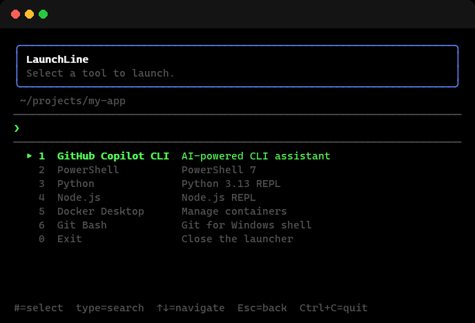
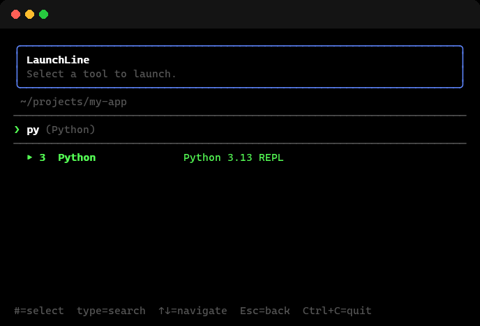
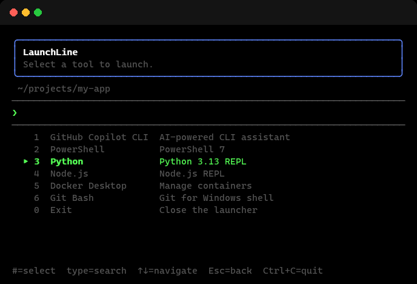

# LaunchLine


> [!NOTE]
> This project was created with the assistance of AI.

[](https://github.com/mikejhill/launchline/actions/workflows/ci.yml)
[](https://github.com/mikejhill/launchline/actions/workflows/publish.yml)

A lightweight terminal launcher for interactive CLI tools. Define your frequently
used commands in a TOML config file, then pick them from a fuzzy-searchable menu
instead of remembering flags and paths.



## Why

Switching between CLI tools — AI assistants, shells, dev utilities — means
remembering commands, flags, working directories, and environment variables.
LaunchLine puts them all in one menu so you press a number or type a few letters
instead.

## Features

- **Fuzzy search** — type any substring to narrow the list instantly
- **Numbered shortcuts** — press a digit to launch directly
- **Per-entry environment and working directory** — set once, forget forever
- **Auto-restart or exit** — configurable behavior after a tool exits
- **Zero runtime dependencies** — pure Python 3.12+, nothing to install beyond itself
- **Auto-generated starter config** — creates `~/.config/launchline/config.toml`
  on first run if no config exists

|           Fuzzy search            |         Arrow-key navigation          |
| :-------------------------------: | :-----------------------------------: |
|  |  |

## Installation

### From PyPI (recommended)

```sh
uv tool install launchline
```

Or with pip:

```sh
pip install launchline
```

### From source

```sh
git clone https://github.com/mikejhill/launchline.git
cd launchline
uv tool install .
```

### Run without installing

```sh
git clone https://github.com/mikejhill/launchline.git
cd launchline
uv sync --group dev
uv run launchline
```

## Quick Start

1. Run `launchline`. If no config exists, a starter config is created at
   `~/.config/launchline/config.toml`.
2. Edit the config to add your tools.
3. Run `launchline` again.

Override the config path:

```sh
# CLI flag (highest priority)
launchline --config ~/my-config.toml

# Environment variable
export LAUNCHLINE_CONFIG=~/my-config.toml
launchline
```

Resolution order: `--config` flag > `LAUNCHLINE_CONFIG` env var > default path.

## Configuration Reference

Config file format is [TOML](https://toml.io). The file has an optional
`[settings]` table and one or more `[[entries]]` tables.

### `[settings]`

| Key                      | Type   | Default        | Description                                                       |
| ------------------------ | ------ | -------------- | ----------------------------------------------------------------- |
| `on_exit`                | string | `"restart"`    | Behavior after a launched tool exits: `restart` or `exit`         |
| `title`                  | string | `"LaunchLine"` | Window/tab title shown while the launcher is active               |
| `clear_on_launch`        | bool   | `true`         | Clear terminal before launching an entry                          |
| `show_exit`              | bool   | `true`         | Show the **Exit** entry (shortcut `0`) in the menu                |
| `ghost_text`             | bool   | `true`         | Show the highlighted entry name as an autocomplete hint on prompt |
| `instant_numeric_launch` | bool   | `true`         | Pressing a digit immediately launches the matching entry          |

### `[[entries]]`

Each `[[entries]]` table defines one launchable tool:

| Key                 | Type            | Required | Default | Description                                                |
| ------------------- | --------------- | -------- | ------- | ---------------------------------------------------------- |
| `name`              | string          | yes      | —       | Display name shown in the menu                             |
| `command`           | string          | yes      | —       | Executable to run                                          |
| `args`              | list of strings | no       | `[]`    | Arguments passed to the command                            |
| `description`       | string          | no       | `""`    | Short description shown next to the name                   |
| `working_directory` | string          | no       | —       | Working directory for the subprocess                       |
| `env`               | table           | no       | `{}`    | Extra environment variables (`KEY = "value"`)              |
| `icon`              | string          | no       | —       | Path to an icon file used for terminal profile integration |

### Validation Rules

- At least one `[[entries]]` table is required.
- Every entry must have both `name` and `command`.
- `on_exit` must be `"restart"` or `"exit"`.
- `args` must be a list (not a bare string).
- `env` must be a TOML table (not a string or list).
- If `working_directory` does not exist at load time, it is silently reset to
  `None` (a warning is logged).
- If `icon` does not exist at load time, it is silently reset to `None` (a
  warning is logged).

### Example Config

```toml
[settings]
on_exit = "restart"
title = "My Tools"
clear_on_launch = true
show_exit = true
ghost_text = true
instant_numeric_launch = true

[[entries]]
name = "GitHub Copilot CLI"
command = "copilot"
icon = "~/.config/launchline/icons/copilot.png"

[[entries]]
name = "Claude Code"
command = "claude"
description = "Anthropic coding agent"
working_directory = "~/projects"

[[entries]]
name = "PowerShell"
command = "pwsh"
args = ["-NoProfile"]
env = { TERM = "xterm-256color" }
```

## Usage

| Key           | Action                                    |
| ------------- | ----------------------------------------- |
| `1`–`9`       | Launch entry by number                    |
| `0`           | Exit (when `show_exit` is enabled)        |
| Type any text | Fuzzy-filter the entry list               |
| `Up` / `Down` | Move highlight                            |
| `Enter`       | Launch highlighted entry                  |
| `Escape`      | Clear filter (or exit if filter is empty) |
| `Backspace`   | Delete last character from filter         |
| `Ctrl+U`      | Clear filter                              |

## Windows Terminal Integration

Add LaunchLine as a Windows Terminal profile to use it as your default launcher.
The project includes an icon in `assets/launchline.ico` — copy it to a permanent
location or reference it directly from your clone:

```jsonc
// In your Windows Terminal settings.json → profiles.list
{
  "name": "LaunchLine",
  "commandline": "launchline",
  "startingDirectory": "%USERPROFILE%",
  "icon": "C:/path/to/launchline/assets/launchline.ico"
}
```

Set it as the default profile to see the launcher every time you open a terminal.

> **Note:** Current terminals do not support changing the tab icon dynamically
> when a sub-CLI is launched.  The per-entry `icon` field is reserved for future
> terminal integrations that add this capability.

## Development

```sh
uv sync --group dev
uv run pytest
uv run ruff check .
uv run mypy src
```

## License

MIT
